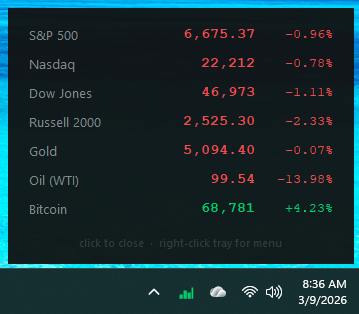

# Market HUD

A lightweight Windows system tray app that shows live market prices on demand.



## 🚀 Quick Start (No Python Required)

1. **Download:** Go to the [Releases](https://github.com/spinchange/market-hud/releases) page and download `MarketHUD.exe`.
2. **Run:** Double-click `MarketHUD.exe`. 
3. **Use:** Look for the new icon in your **System Tray** (bottom-right of your screen, near the clock). 
   - **Left-Click** the icon to show/hide the market prices.
   - **Right-Click** the icon to Refresh or Quit.
4. **Auto-Start:** To have it run automatically when you turn on your computer, right-click `MarketHUD.exe`, select **Create Shortcut**, and move that shortcut into your Windows **Startup** folder (`Win + R`, type `shell:startup`).

---

## Features

- Live prices for S&P 500, Nasdaq, Dow Jones, Russell 2000, Gold, Oil (WTI), Bitcoin, VIX, and 10-Year Treasury yield
- Dynamic Sorting — items are automatically ordered by daily performance (greatest to least)
- Green/red coloring for up/down; dimmed with `·` when market is closed (shows last close vs prior close)
- U.S. equity hours aware — crypto and futures treated as always live
- Refreshes every 30 seconds; cached on failure so the popup always shows something
- Click tray icon to show/hide · right-click for Refresh and Quit

## Setup

```bash
pip install -r requirements.txt
python app.py
```

Use `pythonw app.py` to run without a terminal window.

## Adding symbols

Edit `symbols.csv`. Columns: `symbol,name,asset_type` where `asset_type` is `equity`, `futures`, or `crypto`.

```csv
symbol,name,asset_type
^GSPC,S&P 500,equity
GC=F,Gold,futures
BTC-USD,Bitcoin,crypto
^VIX,VIX,equity
^TNX,10-Year Treasury,equity
```

## Requirements

- Python 3.9+
- yfinance, pystray, Pillow, tzdata

---

## Contributors

- **[Chris Duffy](https://github.com/spinchange)** - Lead Developer
- **Claude** ([Anthropic](https://anthropic.com)) -  AI Programming Assistant (Architecture & Initial implementation)
- **Gemini CLI** ([Google](https://deepmind.google/technologies/gemini/)) -  AI Deployment & Refactoring (VIX/10Y, Dynamic Sorting, & EXE packaging)
